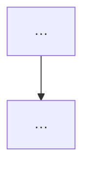

# ADR-NNN — Title

**Status:** Proposed  
**Date:** YYYY-MM-DD  
**Owner:**  
**Runtime:**  
**Horizon:**  
**Supersedes:**  
**Incorporates:**  
**Plan:**  

**Scope note — runtimes (do not conflate):**

| Scope | Runtime |
|-------|---------|
| This authoring session | |
| Production / always-on | |
| Target design | |

---

## 1. Context

<!-- Problem + why now. Precision over length. -->

### Verified state

| Domain | Live fact | Consequence |
|--------|-----------|-------------|
| | | |

### Explicitly unverified

| Claim | Why it matters | Resolve in |
|-------|----------------|------------|
| | | |

## 2. Decision

| # | Decision |
|---|----------|
| **D1** | … |
| **D2** | … |

## 2b. Diagrams (required)

<!-- Every ADR needs BOTH markdown flowchart (Mermaid) and diagrams.net .drawio -->
<!-- Object legend + edge legend; labels clearly visible -->

### Object legend

| Object / zone | What it is | Where | Notes |
|---------------|------------|-------|-------|
| … | | | |

### Edge legend

| Style / label | Meaning |
|---------------|---------|
| Solid | Primary path |
| Dashed | Optional / deferred / escalate-only |

### Markdown flowchart

### diagrams.net

- File: `diagrams/<slug>.drawio`
- Open: app.diagrams.net or Draw.io editor

## 3. Non-goals

- …

## 4. Alternatives

| Option | Why not |
|--------|---------|
| | |

## 5. Architecture notes (optional)

<!-- tiers, trust boundaries, data flow — short; diagram skill if needed -->

## 6. Phases

- [ ] **P0** — protect existing value / security  
- [ ] **P1** — …  
- [ ] **P2** — …  

## 7. Open questions (gates)

| # | Question | Recommendation | Blocks |
|---|----------|----------------|--------|
| Q1 | | | |

## 8. Risks and residuals

| Risk | Mitigation / accept |
|------|---------------------|
| | |

## 9. References

<!-- no secrets -->
