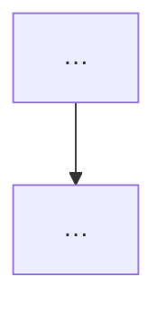

# ADR-NNN — Title

**Status:** Proposed  
**Date:** YYYY-MM-DD  
**Owner:**  
**Runtime:**  
**Horizon:**  

---

## 1. Context

<!-- <=10 lines: problem, constraints, who is affected. Plain language. -->

## 2. Decision

| # | Decision |
|---|----------|
| **D1** | … |
| **D2** | … |

## 2b. Diagrams (required)

<!-- Every ADR needs BOTH: -->
<!-- 1) Mermaid (or equivalent) markdown flowchart — embed below + optional diagrams/*.mmd -->
<!-- 2) diagrams.net / draw.io .drawio file — link path; same objects as Mermaid -->
<!-- Include object legend + edge legend; labels must be clearly visible -->

### Object legend

| Object / zone | What it is | Where | Notes |
|---------------|------------|-------|-------|
| … | | | |

### Edge legend

| Style / label | Meaning |
|---------------|---------|
| Solid | Primary path |
| Dashed | Optional / deferred / escalate-only |

### Markdown flowchart

### diagrams.net

- File: `diagrams/<slug>.drawio`
- Open: app.diagrams.net or Draw.io editor

## 3. Non-goals

- …

## 4. Alternatives

| Option | Why not (or why second) |
|--------|-------------------------|
| A | |
| B | |
| Do nothing | |

## 5. Phases

- [ ] P0 — …
- [ ] P1 — …

## 6. Open questions

| # | Question | Blocks | Owner |
|---|----------|--------|-------|
| Q1 | | | |

## 7. References

<!-- paths/links only; no secrets -->
